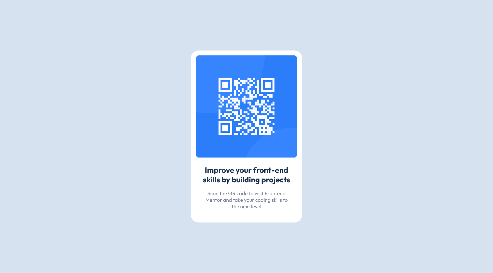
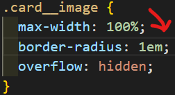
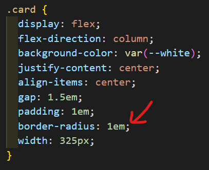

# Frontend Mentor - QR code component solution 🚀


## Welcome 👋

This is a solution to the [QR code component challenge on Frontend Mentor](https://www.frontendmentor.io/challenges/qr-code-component-iux_sIO_H/). Frontend Mentor challenges help you improve your coding skills by building realistic projects.

## Table of contents 📑

- [Overview 🌟](#overview-🌟)
  - [The Challenge 🧪](#the-challenge-🧪)
  - [Screenshots 📷](#screenshots-📷)
  - [Links 🔗](#links-🔗)
- [My process 🏗️](#my-process-🏗️)
  - [Built with 🛠️](#built-with-🛠️)
  - [What I learned 🧠](#what-i-learned-🧠)
  - [Continued development 🚀](#continued-development-🚀)
  - [Useful resources 📚](#useful-resources-📚)
- [Acknowledgments 🙏](#acknowledgments-🙏)
- [Contact 📧](#contact-📧)
- [Author 👤](#author-👤)

## Overview 🌟

### The Challenge 🧪

✅ Your challenge is to build out this QR code component and get it looking as close to the design as possible.

### Screenshots 📷

_My solution (Desktop):_


_My solution (Mobile)_


### Links 🔗

- Solution repo on Github: [here]()
- Solution link on Front End Mentor: [here]()
- Live site link: [here](beanythecoder.github.io/qr-code-component-main)

## My process 🏗️

### Built with 🛠️

- HTML & CSS

### What I learned 🧠

When creating the border radius for the card, I stumbled upon an issue:






The border-radius of the card and that of the image is off, even though they are set to the same value.

But there is a simple fix to that. Simply set the border-radius of the outer container(in this case `.card`), to that of the inner container(`.card__image`) + the padding of the outer container

So to fix this issue, I'll set the border-radius of `.card` to the border-radius of `.card__image`(1em) + padding(1em)

```css
.card {
  // 1em + 1em makes 2em for border-radius
  border-radius: 2em;
  padding: 1em;
}

.card__image {
  border-radius: 1em;
}
```

## Contact 📧

- Frontend Mentor - [@BeanyTheCoder](https://www.frontendmentor.io/profile/BeanyTheCoder)
- Github - [BeanyTheCoder](https://github.com/BeanyTheCoder)

## Author 👤

My name is Alexander Afoko Jnr. and I am a passionate 13-year-old frontend developer from Ghana.
I hope to build up my portfolio and take my skills to the next level.
